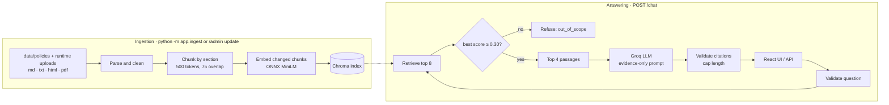

# PolicyPal — Company Policy Assistant (RAG)

PolicyPal is a Retrieval-Augmented Generation (RAG) web application that answers employee questions about the policies of a fictional company, Acme Corp. It retrieves the relevant policy passages, generates an answer using only those passages, and returns numbered citations with the supporting snippet and a link to the source section. Questions outside the policy corpus, or not supported by the retrieved evidence, are refused instead of answered from general knowledge.

- **Live app:** <https://policypal-8u6n.onrender.com> (health: [/health](https://policypal-8u6n.onrender.com/health), policy management: [/admin](https://policypal-8u6n.onrender.com/admin)). See [deployed.md](deployed.md).
- **Design and evaluation:** [design-and-evaluation.md](design-and-evaluation.md)
- **AI tooling:** [ai-tooling.md](ai-tooling.md)

> **Corpus provenance.** The 12 policies in `data/policies/` are synthetic documents created for this project about a fictional company. They may be committed and redistributed with the project.

## Contents

1. [Quick start for reviewers](#1-quick-start-for-reviewers)
2. [Tested configuration](#2-tested-configuration)
3. [Architecture](#3-architecture)
4. [Local setup](#4-local-setup)
5. [API](#5-api)
6. [Updating policies](#6-updating-policies)
7. [Guardrails and citations](#7-guardrails-and-citations)
8. [Offline mode](#8-offline-mode)
9. [Evaluation](#9-evaluation)
10. [Tests and CI/CD](#10-tests-and-cicd)
11. [Deployment](#11-deployment)
12. [Configuration reference](#12-configuration-reference)
13. [Project layout](#13-project-layout)

---

## 1. Quick start for reviewers

The fastest way to see everything is the live app. The free Render instance sleeps when idle, so the first request can take about a minute.

1. Open <https://policypal-8u6n.onrender.com> and click an example question, or ask your own (e.g. *"How long is primary caregiver parental leave?"*). Click a citation number to open its source card, then **View source** to see the cited section.
2. Ask something outside the policies (*"What is the capital of France?"*) to see the refusal.
3. **Try a policy update** at [/admin](https://policypal-8u6n.onrender.com/admin). The admin token is given in the submission PDF.
   - Upload [`examples/policy-updates/POL-02_paid_time_off_update.md`](examples/policy-updates/) with **Replaces → POL-02**. Ask *"How many unused PTO days can I carry over?"* again: the answer changes from 5 to **8** days and cites **POL-02 version 1.1**.
   - Upload [`examples/policy-updates/POL-13_parking_policy.md`](examples/policy-updates/) as a new policy. Ask *"How many spaces does the headquarters car park have?"* (answer: 120, cited to POL-13).
   - Click **Reset to original policies** when done.

To run it on your own machine instead, follow [§4](#4-local-setup) (about 10 minutes, Python 3.11 and Node.js 20+).

## 2. Tested configuration

| Setting | Value |
|---|---|
| Backend | Flask 3 + gunicorn |
| Frontend | React 19 + Vite, built to static files served by Flask |
| Vector store | Chroma persistent client (cosine) |
| Embeddings | ONNX `all-MiniLM-L6-v2-onnx` (384 dimensions, no PyTorch) |
| Retrieval | `TOP_K=8` candidates → `TOP_N=4` passages, `SCORE_THRESHOLD=0.30`, no re-ranking |
| LLM | Groq `openai/gpt-oss-20b`, temperature 0, `MAX_TOKENS=300` |
| LLM fallback | `extractive:offline` (quotes the best passages) if the provider fails |
| Chunking | Heading-first, 500-token windows, 75-token overlap |
| Seed | 42 |

The corpus has 12 policies (Markdown, text, HTML and PDF; about 32 pages) and produces 203 indexed chunks.

## 3. Architecture



Retrieval, generation and citation assembly are separate modules (`app/retriever.py`, `app/generator.py`, `app/citations.py`) orchestrated by `app/rag.py`; see [design-and-evaluation.md](design-and-evaluation.md) for the reasoning behind each choice.

## 4. Local setup

Requirements: **Python 3.11** (3.12/3.13 also work) and **Node.js 20.19+** (to build the UI). A free Groq API key from <https://console.groq.com>.

### Windows (PowerShell)

```powershell
git clone https://github.com/<your-account>/company-policy-rag.git
cd company-policy-rag

py -3.11 -m venv .venv
.\.venv\Scripts\Activate.ps1            # if blocked: Set-ExecutionPolicy -Scope Process RemoteSigned

python -m pip install --upgrade pip
pip install -r requirements-lite.txt    # ONNX configuration, no PyTorch

Copy-Item .env.example .env
notepad .env                             # set LLM_API_KEY (and ADMIN_TOKEN to try /admin)

python -m app.ingest                     # builds the index; downloads the ONNX model once
npm --prefix frontend ci
npm --prefix frontend run build
python -m flask --app app run --host 127.0.0.1 --port 5000
```

### macOS / Linux

```bash
git clone https://github.com/<your-account>/company-policy-rag.git
cd company-policy-rag
python3.11 -m venv .venv && source .venv/bin/activate
pip install --upgrade pip && pip install -r requirements-lite.txt
cp .env.example .env                     # set LLM_API_KEY (and ADMIN_TOKEN)
python -m app.ingest
npm --prefix frontend ci && npm --prefix frontend run build
python -m flask --app app run --host 127.0.0.1 --port 5000
```

Open <http://127.0.0.1:5000>. A successful ingest prints `Indexed 203 chunks from 12 documents … (onnx: all-MiniLM-L6-v2-onnx …)`.

Check health from another terminal:

```powershell
Invoke-RestMethod http://127.0.0.1:5000/health     # or: curl http://127.0.0.1:5000/health
```

```json
{"status": "ok", "index_ready": true, "chunks": 203, "documents": 12, "embed_backend": "onnx", "llm_provider": "groq", "...": "..."}
```

`/health` never calls the LLM. Never commit `.env`; it is listed in `.gitignore`.

## 5. API

### `POST /chat`

```powershell
$body = @{ question = "How many unused PTO days can I carry over into the next year?" } | ConvertTo-Json
Invoke-RestMethod -Uri http://127.0.0.1:5000/chat -Method Post -ContentType "application/json" -Body $body
```

```bash
curl -s http://127.0.0.1:5000/chat -H 'Content-Type: application/json' \
  -d '{"question": "How many unused PTO days can I carry over into the next year?"}'
```

Example response (shortened; wording, scores and timings vary):

```json
{
  "status": "answered",
  "answer": "You may carry over up to 5 unused PTO days into the next calendar year. [1]",
  "refused": false,
  "citations": [
    {
      "id": 1,
      "document_id": "POL-02",
      "document_version": "1.0",
      "title": "Paid Time Off (PTO)",
      "section": "Carry-over",
      "snippet": "Up to 5 unused days of PTO may be carried over into the next calendar year. Carried-over days must be used by 31 March of that year.",
      "source_url": "/sources/POL-02#carry-over"
    }
  ],
  "provider": "groq:openai/gpt-oss-20b",
  "corpus_version": "v1-2a44e4aa53",
  "latency_ms": 790
}
```

| HTTP | `status` | Meaning |
|---|---|---|
| 200 | `answered` | Evidence-backed answer with at least one valid citation |
| 200 | `insufficient_evidence` | Policy-related, but the retrieved passages don't contain the answer |
| 200 | `out_of_scope` | Not related to the policies: *"I can only answer about our policies."* |
| 400 | `invalid_request` | Empty, longer than 2,000 characters, or malformed JSON |
| 503 | `knowledge_base_unavailable` | Index missing or built with a different embedding model |
| 502 / 504 | `provider_error` / `provider_timeout` | LLM failed and no fallback answer was possible |

### Other routes

| Route | Purpose |
|---|---|
| `GET /` | Chat interface |
| `GET /health` | JSON status: index readiness, chunk and document counts, corpus version |
| `GET /sources/<doc_id>` (alias `/docs/<doc_id>`) | The cited policy; PDFs open at `#page=N`, other formats at the section anchor |
| `GET /api/policies` | Policies currently in the knowledge base |
| `GET /admin` and `/api/admin/*` | Policy management (see §6) |

## 6. Updating policies

There are three ways to change what PolicyPal knows. All of them re-index automatically, and only chunks whose text changed are re-embedded (an update typically re-embeds 5–25 chunks instead of 203).

### 6.1 Admin page (no code, works on the live site)

Set `ADMIN_TOKEN` (in `.env` locally, or in Render → Environment), open **`/admin`** and sign in with that token.

- **Add a policy:** choose a `.md`, `.txt`, `.html` or `.pdf` file (≤ 5 MB) and click **Add policy**.
- **Update a policy:** choose the file and pick the policy under **Replaces** (or use the same `doc_id` inside the file). If no version is given, it is increased automatically (1.0 → 1.1), and citations show the new version.
- **Remove / Revert:** removing an uploaded replacement brings the original back; removing an original hides it.
- **Reset to original policies** discards every runtime change.

Files do not need special formatting. Missing metadata is filled in: the ID comes from a `POL-13_…` file name (otherwise `DOC-<name>`), the title from the first heading, the version defaults to 1.0 and the effective date to today. You can override any of these on the form. A template is available from the admin page ([`/api/admin/template`](https://policypal-8u6n.onrender.com/api/admin/template)), and two ready-made examples are in [`examples/policy-updates/`](examples/policy-updates/).

Runtime uploads are stored in `storage/uploads/` (`POLICY_UPLOAD_DIR`), never in `data/policies/`, so reset always restores the committed corpus. On Render's free plan the disk is temporary: uploads last until the service restarts or redeploys.

### 6.2 API (scripts and automation)

```bash
TOKEN=your-admin-token
URL=http://127.0.0.1:5000        # or https://policypal-8u6n.onrender.com

curl -H "Authorization: Bearer $TOKEN" $URL/api/admin/policies                      # list
curl -H "Authorization: Bearer $TOKEN" -F "file=@examples/policy-updates/POL-13_parking_policy.md" \
     $URL/api/admin/policies                                                          # add or replace
curl -H "Authorization: Bearer $TOKEN" -F "file=@new_pto.pdf" -F "doc_id=POL-02" -F "version=2.0" \
     $URL/api/admin/policies                                                          # replace with explicit metadata
curl -X DELETE -H "Authorization: Bearer $TOKEN" $URL/api/admin/policies/POL-13      # remove / revert
curl -X POST   -H "Authorization: Bearer $TOKEN" $URL/api/admin/reset                # restore originals
curl -X POST   -H "Authorization: Bearer $TOKEN" $URL/api/admin/reindex              # rebuild from disk
```

PowerShell equivalent for an upload (PowerShell 7+):

```powershell
Invoke-RestMethod -Method Post -Uri "$URL/api/admin/policies" -Headers @{ Authorization = "Bearer $TOKEN" } `
  -Form @{ file = Get-Item .\examples\policy-updates\POL-13_parking_policy.md }
```

Without `ADMIN_TOKEN` every admin endpoint returns 403; a wrong token returns 401. Failed uploads (unreadable PDF, empty file, bad date) return 422 and leave the knowledge base unchanged.

### 6.3 Permanent changes (committed to the repository)

1. Add or edit files in `data/policies/` (for the three PDFs, edit `data/pdf_sources/*.md` and run `python scripts/build_pdfs.py`).
2. `python scripts/build_manifest.py` — records IDs, versions, page counts and hashes in `data/manifest.json`.
3. `python -m app.ingest` — rebuilds the index.
4. Commit and push. CI checks the manifest is current, and the Render image is rebuilt with the new corpus.

The index must also be rebuilt whenever chunking settings or the embedding backend/model change.

## 7. Guardrails and citations

- **Input validation:** questions are trimmed, stripped of control characters and limited to 2,000 characters.
- **Relevance threshold:** if the best similarity is below `SCORE_THRESHOLD`, the request is refused before any LLM call.
- **Evidence-only prompt:** the model may only use the numbered passages, must cite every factual sentence, must reply `INSUFFICIENT_EVIDENCE` when the passages don't answer the question, and treats the question and passages as data (prompt-injection resistance).
- **Citations from metadata:** the model only writes markers like `[1]`. The backend drops invalid markers and builds titles, sections, snippets and links from stored chunk metadata, so the model cannot invent a source. An answer without a valid citation is retried once, then refused.
- **Output limit:** the prompt asks for ≤150 words, the provider is capped at 300 tokens, and the backend enforces a 250-word cap at sentence boundaries.
- **Provider resilience:** if Groq fails, the extractive generator answers by quoting the passages, and the response says `provider: extractive:offline`.
- **Safe display:** answers are rendered as text, not HTML; source pages are served with a restrictive Content-Security-Policy.

## 8. Offline mode

A deterministic, no-key mode for demos without internet access or an API key:

```powershell
.\scripts\setup_offline.ps1      # first time: venv, requirements-lite, index
.\scripts\run_offline.ps1        # start on http://127.0.0.1:5000
```

```bash
./scripts/setup_offline.sh && ./scripts/run_offline.sh
```

Offline mode uses `EMBED_BACKEND=hash` (lexical) and `LLM_PROVIDER=extractive` from `.env.offline`, and enables `/admin` with the local-only token `offline-admin`. It exercises parsing, chunking, indexing, retrieval, guardrails, citations and policy updates, but its answer quality is lower than the ONNX + Groq configuration. Don't use these scripts when you want the ONNX + Groq configuration; they override those settings.

## 9. Evaluation

`eval/questions.jsonl` has 28 questions: 21 direct (every policy), 2 multi-document, 2 missing-evidence, 2 out-of-scope and 1 prompt-injection. Final benchmark (ONNX + Groq `openai/gpt-oss-20b`, 28/28 answered by Groq):

| Metric | Result | Target |
|---|---|---|
| Groundedness (human-reviewed) | **100.0%** (23/23) | ≥ 90% |
| Groundedness (automated lexical proxy) | 73.9% (17/23) | — (paraphrase false negatives, see design doc) |
| Citation accuracy | **100.0%** (23/23) | ≥ 90% |
| Citation validity | **100.0%** (23/23) | 100% |
| Partial match | **95.7%** (22/23) | ≥ 80% |
| Refusal accuracy | **100.0%** (5/5) | 100% |
| Latency p50 / p95 (local) | **790 ms / 954 ms** | < 2.5 s / < 6 s |

Methodology, per-question results, the human review and limitations are in [design-and-evaluation.md](design-and-evaluation.md).

### Reproducing

```powershell
# Terminal 1
python -m flask --app app run --host 127.0.0.1 --port 5000

# Terminal 2
.\.venv\Scripts\Activate.ps1
$env:PRELOAD_PIPELINE="0"
python -m eval.run --url http://127.0.0.1:5000 --name onnx-groq-final --latency-n 10 --delay-s 5
```

`--delay-s` spaces requests to stay within Groq's free-tier rate limits; it is applied after each request is timed, so it does not inflate latency. Results are written to `eval/results/<run-name>/` (`summary.md`, `summary.json`, `results.jsonl`, `latency.csv`, `review_sheet.csv`).

To add an independent LLM-judge groundedness score (a different model from the generator):

```powershell
$env:JUDGE_PROVIDER="groq"; $env:JUDGE_API_KEY="<groq key>"; $env:JUDGE_MODEL="llama-3.3-70b-versatile"
python -m eval.run --url http://127.0.0.1:5000 --name onnx-groq-judge --latency-n 20 --delay-s 5
```

To measure the deployed app, point `--url` at `https://policypal-8u6n.onrender.com` (open the site first so it is awake).

## 10. Tests and CI/CD

```powershell
$env:EMBED_BACKEND="hash"; python -m pytest -q     # 69 backend tests, offline, no API key
npm --prefix frontend test                          # frontend unit tests
npm --prefix frontend run build
python scripts/verify_project.py                    # required files + corpus hashes
```

`.github/workflows/ci.yml` runs on every push and pull request:

1. **Backend:** install dependencies → import check → `data/manifest.json` is current → `python -m app.ingest --strict` → `pytest` → start gunicorn and check `/health`, a real `POST /chat`, and a runtime policy upload followed by a question about the new policy.
2. **Frontend:** `npm ci` → `npm test` → `npm run build`.
3. **Deploy** (push to `main` only, after both jobs pass): calls the Render deploy hook if the `RENDER_DEPLOY_HOOK` secret is set.

The backend tests cover parsing of all four formats, chunking, idempotent and incremental index rebuilds, retrieval, citation mapping, guardrails, the API contract and error paths, and the policy-update flow (add, replace with version bump, remove, reset, invalid files, authentication, concurrency).

## 11. Deployment

The app is deployed on Render's free plan from `render.yaml` and `Dockerfile.render`. The image builds the React UI, installs `requirements-lite.txt` and builds the ONNX index at build time, so it starts ready to answer.

1. Render → **New → Blueprint** → select this repository.
2. Enter `LLM_API_KEY` (Groq key) and `ADMIN_TOKEN` (a long random string) when prompted. Both are stored as secret environment variables, never in the repository.
3. Open the service URL and `/health`.
4. Optional: copy the service's **Deploy Hook** into a GitHub secret `RENDER_DEPLOY_HOOK` and set `autoDeploy: false`, so deploys only happen after CI passes.

`Dockerfile` (PyTorch/sentence-transformers) is kept for hosts with ≥2 GB RAM.

## 12. Configuration reference

| Variable | Tested value | Purpose |
|---|---|---|
| `LLM_PROVIDER` / `LLM_MODEL` | `groq` / `openai/gpt-oss-20b` | Generator (`extractive` = offline) |
| `LLM_API_KEY` | — | Provider key; only in `.env` or host secrets |
| `LLM_TIMEOUT_S`, `LLM_TEMPERATURE`, `MAX_TOKENS` | 30, 0, 300 | Generation limits |
| `EMBED_BACKEND` / `EMBED_MODEL` | `onnx` / `all-MiniLM-L6-v2-onnx` | Embeddings (`hash` = offline) |
| `TOP_K`, `TOP_N`, `SCORE_THRESHOLD`, `RERANK` | 8, 4, 0.30, 0 | Retrieval |
| `CHUNK_TOKENS`, `CHUNK_OVERLAP`, `SEED` | 500, 75, 42 | Chunking and reproducibility |
| `CHROMA_DIR` | `storage/chroma` | Index location |
| `ADMIN_TOKEN` | — | Enables `/admin`; empty disables it |
| `POLICY_UPLOAD_DIR` | `storage/uploads` | Runtime policy uploads |
| `MAX_UPLOAD_MB`, `MAX_UPLOADED_DOCS` | 5, 20 | Upload limits |
| `PRELOAD_PIPELINE` | 1 (app), 0 (evaluator) | Load models at startup |

## 13. Project layout

```text
app/
  __init__.py      create_app(); `app` WSGI object
  config.py        settings from environment / .env; fixed seeds
  parsing.py       md / txt / html / pdf parsing, cleaning, metadata
  chunking.py      heading-first chunking with overlap
  embeddings.py    ONNX, sentence-transformers and offline hash embedders
  vectorstore.py   Chroma persistence
  corpus.py        committed policies + runtime uploads, manifest hashes
  ingest.py        `python -m app.ingest` (incremental re-embedding)
  retriever.py     top-k retrieval, optional re-ranking
  generator.py     evidence-only prompt, Groq client, extractive fallback
  guardrails.py    validation, refusals, length cap
  citations.py     marker → citation mapping and snippets
  rag.py           pipeline orchestration, read/write lock for updates
  admin.py         policy management API
  routes.py, sources.py   HTTP routes and source rendering
frontend/src/      React chat (App.jsx) and admin page (Admin.jsx)
data/policies/     12 committed policies;  data/manifest.json
examples/policy-updates/   sample files for trying updates
eval/              questions.jsonl, run.py, results/
scripts/           manifest, PDFs, threshold calibration, offline setup, checks
tests/             pytest suite (offline)
.github/workflows/ci.yml, render.yaml, Dockerfile.render, Dockerfile
```
