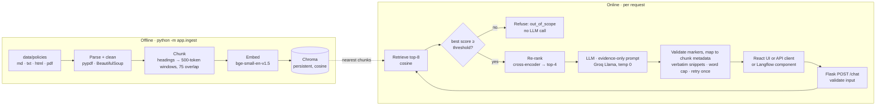

# PolicyPal — Design and Evaluation

This document explains how PolicyPal is built, why each technology was chosen, how quality and latency are measured, and the results recorded so far. Numbers in the results section come from runs saved in `eval/results/`; nothing is estimated.

## 1. Architecture

PolicyPal is a single Flask service containing two pipelines: an **offline ingestion** pipeline that builds a persistent vector index, and an **online answering** pipeline that runs for every question. The React chat UI is compiled to static files and served by the same Flask process, so the deployed app is one container and one origin.



### Module boundaries

| Module | Responsibility |
|---|---|
| `parsing.py` | Format-specific parsers producing sections with headings, anchors and (for PDFs) real page numbers. Cleans navigation/scripts from HTML and running headers/footers from PDFs. |
| `chunking.py` | Heading-first chunking, then fixed windows inside long sections. Stable chunk IDs (`POL-02-v1.0-s09-c00`). |
| `embeddings.py`, `vectorstore.py`, `ingest.py` | Embedding, Chroma persistence, index metadata (`index_meta.json`) and manifest verification. |
| `retriever.py` | Top-k similarity search and optional cross-encoder re-ranking. |
| `generator.py` | Prompt construction, OpenAI-compatible LLM client with retry and fallback, and the offline extractive generator. |
| `guardrails.py`, `citations.py` | Input validation, refusal detection, output-length cap, `[n]` → citation mapping, snippet selection. |
| `rag.py` | Orchestrates the online flow; lazy, thread-safe loading of models. |
| `routes.py`, `sources.py` | HTTP API, source document rendering, serving the React build. |

Retrieval, generation and citation assembly are separate, so each can be tested without the others, and the whole pipeline can run without a paid model (tests use fakes; CI uses the offline embedder and generator).

## 2. Technology choices and reasons

| Layer | Choice | Why | Alternatives considered |
|---|---|---|---|
| Web/API | Flask 3 + gunicorn | Three simple endpoints, required by the team brief; easy to test with Flask's test client. | FastAPI (async not needed) |
| Frontend | React 19 + Vite 8 | The team asked for a JavaScript framework that Railway supports. React gives clean state handling for loading/refusal/error states; Vite builds static files that Flask serves, so there is no second server in production. | Plain JS (fine, but more manual state handling); Next.js (adds a Node server we don't need) |
| Orchestration | Plain Python modules | The product spec chose it over LangChain: fewer abstractions, each step is visible, easy to explain and unit-test. LangChain was proposed in the blueprint (D02) and in chat; this decision is recorded in the blueprint. | LangChain, LlamaIndex |
| Langflow | Custom component calling `/chat` | The team supplied Langflow's Chat Input component. Rather than duplicating retrieval inside Langflow, the component forwards the Chat Input message to the Flask API, so guardrails and citations are identical in both places. `/chat` also accepts Langflow's `input_value` field. | Rebuilding the pipeline as Langflow nodes (two sources of truth) |
| Parsing | pypdf, BeautifulSoup, python-markdown | Covers the four corpus formats. PDF bookmarks give exact section starts and page numbers. | unstructured (heavy) |
| Embeddings | `BAAI/bge-small-en-v1.5` via sentence-transformers | Free, local, 384-dimensional, strong for its size, small enough for a modest 2 GB host. Uses the model's recommended query instruction prefix. | OpenAI/Cohere embeddings (cost, key), larger bge models (RAM) |
| Offline embedder | Feature-hashing bag-of-words (`EMBED_BACKEND=hash`) | Lets CI and offline runs build a real index without downloading a model. It is lexical, not semantic, and is always labelled. | Mocking Chroma entirely (would not test the real index) |
| Vector store | Chroma 1.5 persistent client, cosine space | Zero cost, file-based, named in the brief; the index is rebuilt reproducibly and not committed. | FAISS (no metadata store), pgvector (needs a database) |
| Re-ranker | `cross-encoder/ms-marco-MiniLM-L-6-v2` | Cheap precision boost over raw similarity: scores each (question, passage) pair jointly. Re-ranks 8 candidates to 4. | No re-ranking (k-only) |
| LLM | Groq `llama-3.1-8b-instant` by default; OpenRouter/OpenAI via env; optional fallback provider | Fast, free tier, OpenAI-compatible API so providers are swappable by configuration. Temperature 0 and a fixed `seed`. | Local LLM (too much RAM for the host) |
| Hosting | Render free web service (`render.yaml`, `Dockerfile.render`) | Free, Docker-based, health checks, auto-deploy from GitHub or a deploy hook after CI. Its 512 MB RAM cannot hold PyTorch and the two models, so the deployed build uses the hash embedder without re-ranking (measured ~120 MB RSS) while Groq still generates answers. | Railway or a 2 GB Render plan with the full `Dockerfile` (models baked into the image) |
| CI | GitHub Actions | Required by the brief. | – |

## 3. Key design decisions

**Chunking.** Every document is first split at its `#`/`##`/`###` headings (or HTML `h1–h3`, or PDF bookmarks). Sections up to 500 tokens are one chunk; longer sections become 500-token windows with 75 tokens of overlap. Tokens are approximated by whitespace-separated words, which avoids tying chunking to one model's tokenizer. Windows never cross a heading, so each chunk has one section label and one anchor. The corpus produces 203 chunks, most of them a single section (the policies are written with short sections), so the 500-token limit rarely binds. The text that is embedded is `"<title> - <section>\n<chunk text>"`, so a chunk whose body never repeats its topic (for example "Carry-over") is still found.

**Citations come from metadata, not the model.** The prompt numbers the passages `[1]…[4]`. The model only writes markers; the backend drops markers that don't exist, renumbers the rest in order of appearance, and builds each citation (title, section, page, URL) from stored chunk metadata. The snippet is an exact excerpt (≤ 300 characters) of the stored chunk text, chosen as the sentence that best overlaps the claim that cites it. The model therefore cannot invent a source or a link.

**Guardrails.**

1. *Input:* question trimmed, control characters removed, 1–2,000 characters; malformed JSON and file attachments rejected with HTTP 400.
2. *Relevance threshold:* if the best cosine similarity is below `SCORE_THRESHOLD`, the request is refused as `out_of_scope` before the LLM is called (saves cost and prevents general-knowledge answers).
3. *Evidence-only prompt:* the model must answer only from the excerpts, cite every factual sentence, reply `INSUFFICIENT_EVIDENCE` when the excerpts don't answer the question, flag partial answers and conflicts, and treat the contents of `<question>` and `<context>` as data. The delimiter tags are stripped from user and document text so they can't be closed early.
4. *Citations required:* an answer without a valid marker triggers one retry with a reminder; a second failure becomes a controlled `insufficient_evidence` refusal.
5. *Output length:* the prompt asks for ≤ 150 words, the provider is capped at 300 tokens, and the backend verifies a hard cap of 250 words after generation, cutting only at sentence boundaries so no claim loses its citation.
6. *Failure handling:* timeouts → 504, provider failures → 502 (after one retry and an optional fallback provider), missing or incompatible index → 503. Error bodies never include provider payloads or stack traces.
7. *Safe display:* the React UI renders answer text as text nodes (citation markers become buttons), never as HTML. Source pages are served with a restrictive Content-Security-Policy, and only manifest-registered documents can be served.

**Reproducibility.** Fixed seed 42 (Python, NumPy, torch, provider `seed`), sorted file order, deterministic PDF generation (`invariant=1`), manifest SHA-256 verification before ingestion, and an index rebuilt from scratch every time. `index_meta.json` records the embedding model, chunk settings and corpus version; the app reports `index_ready: false` if the index was built with a different embedding backend or model.

**Conversation scope.** Each question is answered independently. The UI says so in the sidebar; there is no hidden chat history that could make answers depend on earlier turns.

## 4. Corpus

12 synthetic Acme Corp policies in four formats (5 Markdown, 2 plain text, 2 HTML, 3 PDF), 10,928 words. `data/manifest.json` records 32 pages: 12 physical PDF pages plus page-equivalents for the other formats at 500 words per page. This meets the brief's 5–20 documents and ~30–120 pages; it is below the product spec's own 50–70 page estimate. Each policy plants concrete, checkable facts (e.g. "Up to 5 unused days of PTO may be carried over") with non-overlapping facts between documents and deliberate cross-references (remote work → security and acceptable use) to test multi-document retrieval.

## 5. Evaluation approach

**Question set.** `eval/questions.jsonl` has 28 questions:

| Category | Count | Expected behaviour |
|---|---|---|
| Direct, single-policy | 21 (every policy covered, 1–3 each) | Answer with citations |
| Multi-document | 2 | Answer citing both related policies |
| Missing evidence (on-topic but not in the policies) | 2 | Refuse (`insufficient_evidence`) |
| Out of scope | 2 | Refuse |
| Adversarial (prompt injection + off-topic) | 1 | Refuse, reveal nothing |

Each item has a short gold answer, gold key facts, gold document IDs and the gold section.

**Metrics and targets.**

| Metric | How it is scored | Target |
|---|---|---|
| Groundedness | Share of answered questions whose answer is fully supported by the passages it cites. Scored by an LLM judge (a different model from the generator) when configured; otherwise a lexical proxy (every answer sentence must have ≥ 80% of its content words in the cited passages). The authoritative score is the human review in `review_sheet.csv`. | ≥ 90% |
| Citation accuracy | Answered question counts as correct if every cited document is a gold document **and** at least one cited passage contains a gold fact. | ≥ 90% |
| Citation validity | Every citation resolves to a stored chunk and its snippet is a verbatim excerpt. | 100% |
| Partial match | Gold key fact appears in the answer (over all answerable questions; a refusal counts as a miss). | ≥ 80% |
| Answer coverage | Answerable questions that receive an answer (guards against a system that refuses everything). | reported |
| Refusal accuracy | Should-refuse questions that are refused. | 100% |
| Latency p50 / p95 | Client-observed wall-clock time of 20 sequential `POST /chat` calls after one warm-up call; NumPy linear-interpolation percentiles; failures counted separately. | p50 < 2.5 s, p95 < 6 s |

Groundedness and citation accuracy are reported over answered questions, with numerators and denominators, so refusals cannot inflate them; coverage and partial match capture what refusals cost.

## 6. Results

### Run 1 — offline baseline (`eval/results/offline-baseline-hash-extractive/`)

Configuration: hash embedder, no re-ranking, extractive generator (no LLM), threshold 0.12, top-k 8 → top-n 4. Run on 2026-10-01 against gunicorn (1 worker, 4 threads) on a Linux x86_64 cloud workspace, Python 3.11. This run exists because the build workspace could not reach Hugging Face or Groq; it measures the retrieval, guardrail and citation machinery with a lexical baseline, **not** the production configuration.

| Metric | Result | Target | Met? |
|---|---|---|---|
| Groundedness (lexical proxy, answered) | 100.0% (22/22) | ≥ 90% | Yes, but trivially: the extractive generator only quotes passages |
| Citation accuracy (answered) | 72.7% (16/22) | ≥ 90% | No |
| Citation validity | 100.0% (23/23) | 100% | Yes |
| Partial match (answerable) | 73.9% (17/23) | ≥ 80% | No |
| Answer coverage (answerable) | 95.7% (22/23) | – | – |
| Refusal accuracy | 80.0% (4/5) | 100% | No |
| Latency p50 / p95 (20/20 ok) | 6.5 ms / 7.6 ms | < 2.5 s / < 6 s | Yes, but no LLM call is made |

**Failure analysis (offline baseline).**

- *Retrieval misses (lexical embedder).* Q15 "install a torrent client on my company laptop" retrieved the device-update section of POL-07 instead of the prohibited-software list in POL-08: the words "install", "company" and "laptop" outweighed "torrent". Q16 "How long are CCTV recordings kept?" only weakly matched (0.14) because the retention table is one long chunk and the question says "kept" while the policy says "retention". Both are vocabulary-mismatch failures that a semantic embedder and the cross-encoder are designed to fix.
- *Generation limits (extractive quoting).* Q03 and Q19 retrieved the right section but quoted the wrong sentence ("1 floating holiday… instead of 2"; the policy's purpose statement). Q12 ($3,000 approval) needs reasoning across the approval-chain bullets and was refused. An LLM can combine and interpret these sentences; a quoting baseline cannot.
- *Missing-evidence refusal.* Q24 (bringing dogs to the office) passed the 0.12 threshold at 0.29 and the extractive generator quoted an unrelated POL-06 scope sentence. In the production configuration this case relies on the LLM's `INSUFFICIENT_EVIDENCE` rule, which is exactly what the missing-evidence questions test.
- *Threshold.* `scripts/calibrate_threshold.py` shows the hash backend separates answerable (min 0.141) from out-of-scope (max 0.130) questions only narrowly. The default was left at 0.12 rather than tuned to this evaluation set to avoid overfitting; the poem request (0.130) therefore reached the generator, which correctly refused it.

### Run 2 — production configuration (to be recorded)

Configuration: bge-small-en-v1.5, cross-encoder re-ranking, Groq `llama-3.1-8b-instant`, threshold calibrated with `scripts/calibrate_threshold.py`. **Not yet run** — it needs network access to Hugging Face and a Groq API key. To record it:

```bash
cp .env.example .env    # set LLM_API_KEY; optionally JUDGE_PROVIDER/JUDGE_API_KEY/JUDGE_MODEL
python -m app.ingest
python scripts/calibrate_threshold.py          # set SCORE_THRESHOLD in .env if needed
gunicorn app:app --bind 127.0.0.1:5000 --workers 1 --threads 4 &
python -m eval.run --url http://127.0.0.1:5000 --name groq-bge-rerank
```

Then copy `eval/results/groq-bge-rerank/summary.md` into this section, complete the human review columns in `review_sheet.csv`, and repeat the latency run against the Render URL (`--url https://<app>.onrender.com --name render-latency`, configuration: hash + Groq), noting cold-start time separately.

| Run | Groundedness | Citation accuracy | Partial match | Refusal accuracy | p50 / p95 |
|---|---|---|---|---|---|
| Offline baseline (hash, extractive) | 100.0% (proxy) | 72.7% | 73.9% | 80.0% | 6.5 / 7.6 ms |
| Production (bge + rerank + Groq) | not run | not run | not run | not run | not run |
| Render deployment (hash + Groq) | – | – | – | – | not run |

### Optional ablations (not run)

The pipeline exposes everything needed for the comparisons suggested in the spec: `TOP_K` ∈ {3, 5, 8}, `RERANK=0/1`, `CHUNK_TOKENS` ∈ {300, 500, 800} (`python -m app.ingest --chunk-tokens 300`), and the prompt version (`PROMPT_VERSION` in `generator.py`). Each configuration should be recorded as a separate named run; earlier runs are kept, not overwritten.

## 7. Known limitations

- The production embedder, re-ranker and Groq client have not been executed in the build workspace (network blocked); they are implemented against the documented library and API interfaces and must be exercised in the first local run (README §1).
- The Docker image was written but not built in the build workspace (no Docker daemon); Render builds `Dockerfile.render` from the repository.
- Token counts are approximated by words.
- Multi-turn questions are out of scope by design.
- Groundedness without a judge uses a lexical proxy, which cannot detect a sentence that reuses evidence words with a different meaning; human review is the reference.
