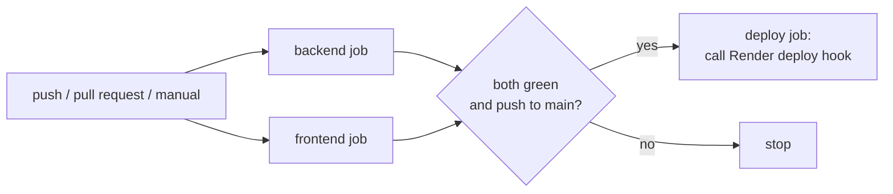

# Using GitHub Actions with PolicyPal

The app is already deployed, but CI still matters. It proves to the grader that every change builds and passes its tests, and it can make Render deploy **only** code that has passed. This guide covers both.

## 1. What the workflow does

`.github/workflows/ci.yml` runs automatically on **every push** (any branch) and **every pull request**, and can be started by hand (**Run workflow**).



| Job | Steps | Time |
|---|---|---|
| **Backend** | Set up Python 3.11 (pip cache) → install dependencies → `import app` → check `data/manifest.json` is current → `python -m app.ingest --strict` → `pytest -q` (73 tests) → start gunicorn and call `/health`, `POST /chat`, upload a policy through `/api/admin` and ask about it | ~4–6 min |
| **Frontend** | Set up Node 22 (npm cache) → `npm ci` → `npm test` → `npm run build` | ~1 min |
| **Deploy** | Only on a push to `main` after both jobs pass. Calls the Render deploy hook if the `RENDER_DEPLOY_HOOK` secret exists; otherwise prints "skipping" and succeeds | seconds |

CI uses the offline embedder and generator (`EMBED_BACKEND=hash`, `LLM_PROVIDER=extractive`), so it needs **no API key** and downloads no models. The LLM path is covered by tests that replace it with fakes.

## 2. Seeing the results

1. Open your repository on GitHub and click the **Actions** tab.
2. The top entry is the latest run. ✅ means it passed, ❌ that it failed, 🟡 that it's running.
3. Click a run, then a job (e.g. *Backend*), then a step (e.g. *Unit, contract and smoke tests*) to read its log.
4. Each commit on the repository's main page also shows a ✅ or ❌ beside it.

## 3. Starting a run without changing code

Since the app is deployed and you may have nothing new to push:

- **Run workflow:** Actions → **CI** (left sidebar) → **Run workflow** → choose `main` → **Run workflow**.
- **Re-run:** open any run → **Re-run all jobs** (top right).
- **Empty commit** (from a terminal):
  ```cmd
  git commit --allow-empty -m "Trigger CI"
  git push
  ```

## 4. Working with pull requests (recommended)

Pull requests show CI at its best: the checks run *before* the change reaches `main`.

```cmd
git checkout -b update-docs
REM ...edit files...
git add -A
git commit -m "Update documentation"
git push -u origin update-docs
```

On GitHub, click **Compare & pull request** → **Create pull request**. The *Backend* and *Frontend* checks appear on the pull request; merge only when both are green. The merge to `main` then runs CI again and, if configured, deploys.

To make the green checks mandatory: **Settings → Branches → Add branch protection rule** (or **Rulesets**) → branch `main` → **Require status checks to pass** → select *Backend* and *Frontend*.

## 5. Deploying to Render only after CI passes

By default Render redeploys on every push to `main`, even if CI later fails. To deploy only tested code:

1. **Copy the deploy hook.** Render → your service → **Settings** → **Deploy Hook** → copy the URL. Treat it like a password.
2. **Store it in GitHub.** Repository → **Settings** → **Secrets and variables** → **Actions** → **New repository secret**:
   - Name: `RENDER_DEPLOY_HOOK`
   - Secret: the URL from step 1
3. **Stop Render deploying on every push.** Render → **Settings** → **Build & Deploy** → **Auto-Deploy**. Choose **After CI Checks Pass** if your plan offers it; otherwise choose **Off**. Then also change `autoDeploy: true` to `autoDeploy: false` in `render.yaml`, so a later Blueprint sync doesn't turn it back on.
4. Push to `main`. When *Backend* and *Frontend* pass, the *Deploy* job calls the hook ("Render deploy triggered."), and Render's **Events** tab shows a new deploy.

Without the secret, the *Deploy* job still runs and passes with "skipping", which is fine; Render's own auto-deploy keeps working.

## 6. Adding a status badge to the README

Add this line at the top of `README.md`, replacing `OWNER/REPO` with your repository (e.g. `M-M-Sibbs/policypal`):

```markdown
[](https://github.com/OWNER/REPO/actions/workflows/ci.yml)
```

## 7. When a run fails

| Failing step | Usual cause | Fix |
|---|---|---|
| *Corpus manifest is up to date* | A file in `data/policies/` changed without updating the manifest | `python scripts/build_manifest.py`, then commit `data/manifest.json` |
| *Build the vector index (strict)* | A policy file is not listed in, or doesn't match, the manifest | Same as above |
| *Unit, contract and smoke tests* | A code change broke a test | Read the failing test name in the log; run `python -m pytest -q` locally |
| *Startup check* | The app didn't start or an endpoint returned an error | Read the gunicorn output above the failing `curl` |
| *npm ci* | `package.json` and `package-lock.json` disagree | `npm --prefix frontend install`, commit `frontend/package-lock.json` |
| *Deploy* | Wrong or expired hook URL | Copy a fresh hook from Render into the secret |

To reproduce CI locally before pushing:

```cmd
set EMBED_BACKEND=hash
set LLM_PROVIDER=extractive
python scripts\build_manifest.py
git diff --exit-code data\manifest.json
python -m app.ingest --strict
python -m pytest -q
npm --prefix frontend test
npm --prefix frontend run build
```

Afterwards, close the window (or `set EMBED_BACKEND=` and `set LLM_PROVIDER=`) before running the ONNX + Groq configuration again.

## 8. Showing CI in the demo

1. Open the **Actions** tab and a recent green run on `main`.
2. Expand *Backend* and point at: dependency install, strict index build, `pytest` (73 passed), and the startup check that calls `/health`, `/chat` and the policy upload.
3. Open *Frontend* (tests and build) and *Deploy* (Render hook, or "skipping").
4. Optionally open a pull request to show checks running before a merge.
