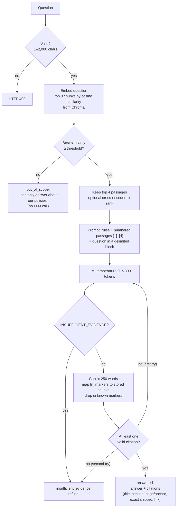

# Project inputs: the product spec, the blueprint and the algorithm

PolicyPal was planned before it was built. Three planning documents and one Langflow component defined what to build; the code then followed them. This page explains each input and shows where it lives in the repository.

## 1. The requirements conversation (the brief, as relayed by the team)

The project brief was first shared in the team chat (1 Oct 2026). It listed ten requirement areas: a 5–20 document policy corpus of 30–120 pages; parsing, cleaning, chunking, embeddings and a vector database; answers with citations, snippets and links, with an output limit and refusals; a web app with `/`, `POST /chat` and `/health`; an isolated environment, `requirements.txt`, README and fixed seeds; a GitHub Actions workflow; 15–30 evaluation questions with groundedness, citation accuracy and p50/p95 latency; three documentation files; optional deployment; and a 5–10 minute demo.

It also proposed a stack (Python + Flask, LangChain, Chroma, a local embedding model, an API-based LLM, HTML/CSS/JS, GitHub Actions) and described the answering flow in one sentence:

> the user asks a question → we retrieve relevant policy sections → the LLM answers using that evidence → we display the answer with citations and supporting snippets. We'll also implement handling for questions the policies cannot answer, then evaluate groundedness, citation accuracy and response time.

That sentence is the algorithm described in §4.

## 2. The development blueprint

`Company_Policy_Assistant_Blueprint 2.md` (Mathew Muwomo, with Munashe Sibanda) is the team's working plan and tracker. Its main contents and where they ended up:

| Blueprint section | What it defined | Where it is in the code |
|---|---|---|
| §4 Requirements matrix | R01–R16 (from the brief) and R17–R21 (traceability, reliability, usability, security, maintenance), each with a verification method | [requirements-compliance.md](../requirements-compliance.md) |
| §5 Architecture | Two flows (offline ingestion, online answering); *"the model returns selected evidence IDs; the backend builds titles, snippets and URLs from trusted metadata — never let the model invent a source URL"*; chunk metadata fields; 500-token chunks, 75 overlap, top-k 4 as the starting point | `app/ingest.py`, `app/rag.py`, `app/citations.py`, `app/chunking.py` |
| §6 UI blueprint | Header, policy sidebar, composer (Enter sends, Shift+Enter new line), numbered citations focusing source cards, mobile layout, and eight required states | `frontend/src/` |
| §7 API contract | `POST /chat` request/response, statuses `answered` / `insufficient_evidence` / `out_of_scope`, errors 400/502/503/504, `/health` with `index_ready`, `/sources/<id>` serving only registered documents | `app/routes.py`, `tests/test_api.py` |
| §8 Safeguards | Documents are evidence, not instructions; citations must exist and snippets must come from stored text; partial and conflicting answers flagged; refuse rather than use general knowledge | `app/generator.py` (prompt), `app/citations.py`, `app/guardrails.py` |
| §10 Evaluation plan | Question categories, per-record fields, metric definitions, latency protocol (sequential, warmed, failures counted) | `eval/questions.jsonl`, `eval/run.py` |
| §9 Milestones M1–M8 | Delivery order and exit gates | Followed in order; progress recorded during the first build |

## 3. The product spec

`Product Spec: PolicyPal RAG Assistant` (Munashe Sibanda, 1 Oct 2026, 11 pages) turned the brief into concrete decisions.

**Goal and scope.** Target a rubric score of 5: every requirement met, publicly deployed, quality and latency measured. Out of scope: user accounts, multi-turn memory, fine-tuning. (Uploading policies through the UI was also out of scope; we later added it as an extension so reviewers can test updates.)

**Success metrics.** Groundedness ≥ 90%, citation accuracy ≥ 90%, partial match ≥ 80%, refusal accuracy 100%, latency p50 < 2.5 s and p95 < 6 s.

**User stories.** US-1 to US-6: an employee asks and gets a quick answer, sees the source passage, is told clearly when a question isn't covered; a developer calls `/chat`; an operator checks `/health`; a grader clones, follows the README and reproduces the results.

**Corpus plan.** Twelve synthetic Acme Corp policies with fixed IDs and formats (POL-01 to POL-12: Markdown, text, HTML and PDF), front-matter metadata, `#`/`##` headings for chunking, concrete planted facts (e.g. carry-over of 5 PTO days, $110 international per diem, 1-hour incident reporting) and a few deliberate cross-references (remote work → security, acceptable use).

**Functional requirements FR-1 to FR-16.**

| FR | Requirement | Implementation |
|---|---|---|
| 1 | Parse md/txt/html/pdf; strip navigation and scripts; remove headers/footers | `app/parsing.py` |
| 2 | Chunk by headings, then ~500-token windows with 75 overlap; keep metadata | `app/chunking.py` |
| 3 | Free embedding model; persistent Chroma collection | `app/embeddings.py` (ONNX MiniLM), `app/vectorstore.py` |
| 4 | `python -m app.ingest` rebuilds idempotently; seed 42; sorted files | `app/ingest.py`, `test_rebuild_is_idempotent…` |
| 5 | Top-k 8 by cosine, optional re-rank, keep 4 | `app/retriever.py` |
| 6 | Below the threshold, skip the LLM and refuse | `app/rag.py` |
| 7 | Numbered evidence in the prompt; answer only from it with `[n]` markers | `app/generator.py` |
| 8 | Map `[n]` to chunk metadata; drop unreferenced citations | `app/citations.py` |
| 9 | Out-of-scope refusal "I can only answer about our policies." | `app/guardrails.py` |
| 10 | `max_tokens` 300 and ≤ 150 words | `app/config.py`, prompt, 250-word hard cap |
| 11 | Citations required: retry once, then refuse | `app/rag.py` |
| 12 | User text in a delimited block, never instructions | `app/generator.py` (`sanitise`, `<question>`) |
| 13 | Chat page with citation cards | `frontend/src/` |
| 14 | `POST /chat` JSON; empty or over-long input → 400 | `app/routes.py` |
| 15 | `/health` JSON status | `app/routes.py` |
| 16 | `/docs/<doc_id>` serves the source | `app/routes.py`, `app/sources.py` |

**Stack.** Python 3.11; Flask; plain Python orchestration; pypdf, BeautifulSoup and python-markdown; bge-small embeddings; Chroma; a cross-encoder re-ranker; a Llama-family model on Groq with a fallback provider; a different model as evaluation judge; Render; GitHub Actions. The final build kept this stack except for three documented changes: a React frontend (team instruction), ONNX MiniLM embeddings (PyTorch blocked on Windows), and Groq `openai/gpt-oss-20b` (chosen after testing, set by environment variable as the spec recommended).

**Evaluation plan.** A scripted evaluation (`python -m eval.run`), a question set with gold answers, documents and sections, per-metric scoring methods, and optional ablations (k, chunk size, prompt variants).

**CI/CD and deployment.** Test on every push and PR, with the LLM mocked so no key is needed; on green `main`, call a Render deploy hook; build the index at deploy time; record the URL in `deployed.md`; report cold start separately.

**Risks.** Free-tier rate limits, memory limits and cold starts, answers beyond the context, judge bias and plagiarism, each with a mitigation that the build follows (model in an environment variable, retries and fallback, small embedding model, strict prompt and threshold, honest AI-tooling record).

## 4. The algorithm

Ingestion runs offline and whenever policies change: parse → clean → chunk → embed → store in Chroma. Only chunks whose text changed are re-embedded.

## 5. The Langflow Chat Input component

The request included the source of Langflow's *Chat Input* component, the Langflow block that turns typed text into a `Message` (with `input_value`, `session_id`, `sender` and optional `files`). It is not a full Langflow flow and contains no LangChain code. PolicyPal uses it in two ways:

- `POST /chat` accepts the component's fields (`input_value`, `session_id`) and rejects `files`.
- [`langflow/policypal_component.py`](../langflow/policypal_component.py) is a Langflow custom component that sends the Chat Input message to PolicyPal and returns the cited answer, so the flow *Chat Input → PolicyPal RAG → Chat Output* gives the same answers as the web app. See [langflow/README.md](../langflow/README.md).
